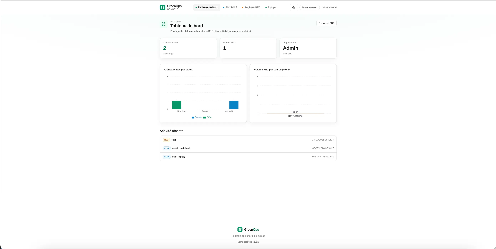
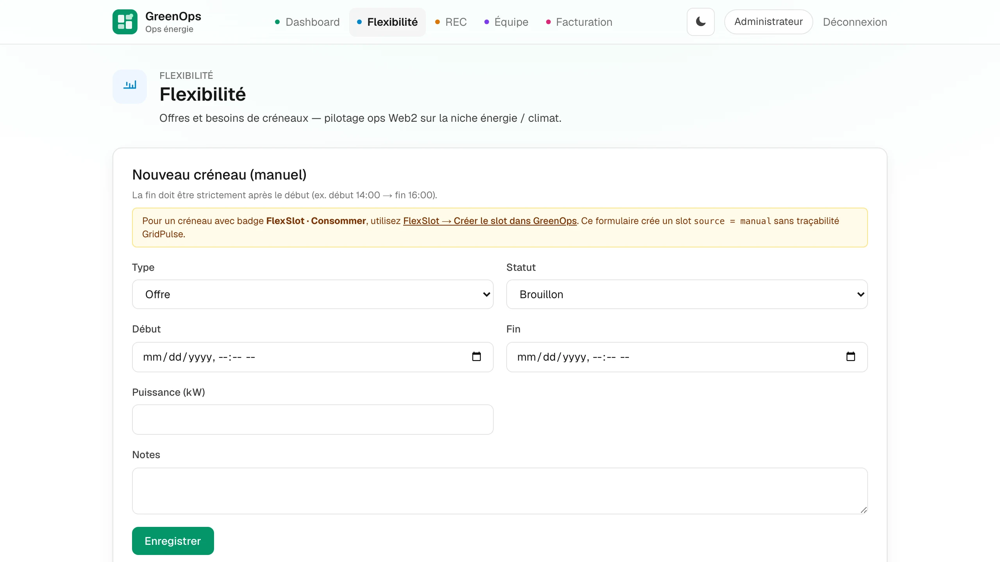
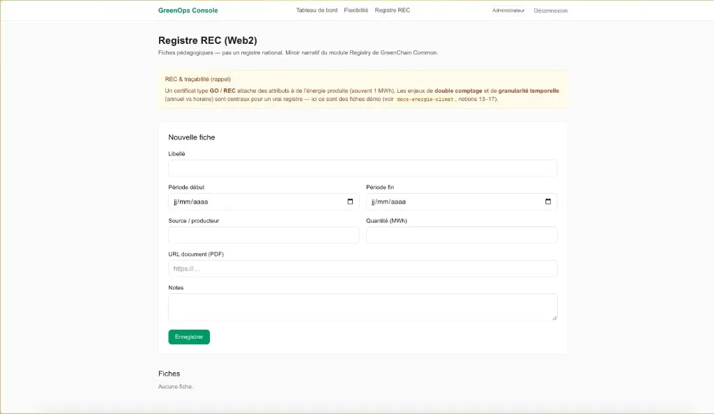

# GreenOps Console

SaaS Web2 **énergie / climat** : flexibilité (créneaux), fiches **REC** pédagogiques, tableau de bord. Même **vision modulaire** que le flagship Web3 **[GreenChain Common](https://github.com/ChristopheChollet/GreenChain-Common)** (vault / market / registry / gouvernance côté dApp) — ici **sans blockchain**, pour une preuve **full-stack employable** (auth, PostgreSQL, RLS, déploiement).

> Démo **non réglementaire** : les REC et quantités sont des **exemples** de pilotage, pas un registre national.

Référence métier longue (checklist notions énergie / climat / Web3) : voir le dossier personnel **`docs-energie-climat`** sur ta machine (à côté des autres projets), fichier `niche_energie_climate.md` — volontairement **hors repo** pour garder ce dépôt focalisé code.

## Captures d'écran

| Dashboard | Flexibilité | Registre REC |
|---|---|---|
|  |  |  |

## Stack

- **Next.js** (App Router) + TypeScript + Tailwind
- **Supabase** : Auth (magic link), PostgreSQL, **Row Level Security**
- **Vercel** (recommandé) + variables d’environnement publiques Supabase

## Démarrage local

1. Créer un projet sur [Supabase](https://supabase.com), activer **Auth → Email** (magic link).

2. Dans l’éditeur SQL Supabase, exécuter le fichier :

   [`supabase/migrations/001_initial_schema.sql`](./supabase/migrations/001_initial_schema.sql)

   (tables `organizations`, `profiles`, `flex_slots`, `rec_certificates`, trigger à l’inscription, RLS.)  
   Si PostgreSQL refuse `execute procedure`, remplacer par `execute function public.handle_new_user();`.

2b. (Recommandé) Même éditeur : exécuter aussi  
   [`supabase/migrations/002_audit_roles.sql`](./supabase/migrations/002_audit_roles.sql)  
   — pistes d’audit (`created_by`, `updated_at`, …), export CSV côté données, rôles **admin** / **viewer** (lecture seule en RLS).  
   Si un trigger refuse `execute function`, essayez `execute procedure` comme pour la migration 001.

2c. (V2) Exécuter [`supabase/migrations/003_org_invitations.sql`](./supabase/migrations/003_org_invitations.sql)  
   — invitations par e-mail, page **Équipe**, plusieurs membres par organisation.

3. **Authentication → URL Configuration** : ajouter en redirect URLs :

   - `http://localhost:3000/auth/callback`
   - votre URL Vercel + `/auth/callback` après déploiement

4. Copier `.env.example` vers `.env.local` et renseigner :

   - `NEXT_PUBLIC_SUPABASE_URL`
   - `NEXT_PUBLIC_SUPABASE_ANON_KEY`
   - `NEXT_PUBLIC_SITE_URL` (ex. `http://localhost:3000`)

5. Installer et lancer :

```bash
npm install
npm run dev
```

Ouvrir [http://localhost:3000](http://localhost:3000), **Connexion**, recevoir le lien par email.

## Déploiement (Vercel)

- Importer le repo, définir les mêmes variables `NEXT_PUBLIC_*`.
- `NEXT_PUBLIC_SITE_URL` = URL de production (ex. `https://greenops.vercel.app`).
- Ajouter cette URL + `/auth/callback` dans Supabase.

## Parcours démo (~2 min)

1. Connexion magic link.  
2. **Flexibilité** : créer un créneau (offre / besoin, statut), **modifier** ou supprimer une fiche, voir la piste d’audit, **Exporter CSV** si au moins une ligne.  
3. **Registre REC** : créer une fiche, **modifier** ou supprimer, audit, export CSV.  
4. **Tableau de bord** : KPI, graphiques, **export PDF** (rapport ops) et activité récente.  
5. **Équipe** (admin) : inviter une adresse e-mail → la personne rejoint l’org à la première connexion.  
6. (Optionnel) Rôle **viewer** : via invitation ou  
   `update public.profiles set role = 'viewer' where user_id = '…';`  
   — l’UI passe en lecture seule.

## Roadmap (hors MVP)

- ~~Multi-utilisateurs par organisation (invitations)~~ — **V2** (page Équipe + migration 003)
- ~~Export PDF léger~~ — **V2** (rapport ops depuis le tableau de bord)
- Trésorerie / enveloppes (miroir « Vault » Web2) — V3+ optionnel
- Votes / propositions (miroir gouvernance) — V3+ optionnel
- Option **Prisma** sur la même base pour le CV

## Famille de produits

- **GreenChain Common** (Web3) : dApp Hardhat + wallet — dépôt séparé `GreenChainCommon` (même « famille » produit / portfolio).
- **GreenOps** (Web2) : ce dépôt — console SaaS B2B de démonstration.
