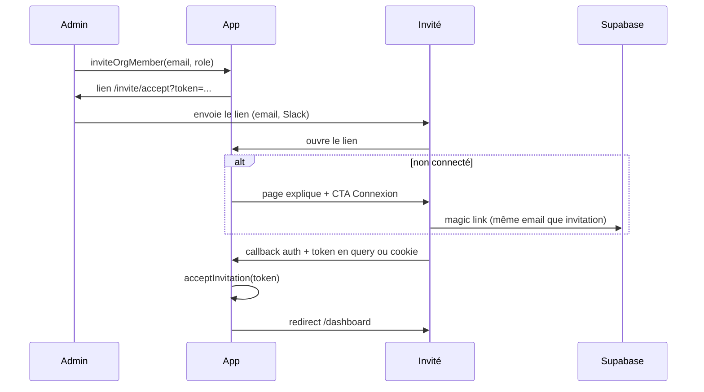

# Spec technique — Invitations organisation + seed démo

**Projet** : GreenOps Console  
**Priorité** : T1 (fiabilité + démo employable)  
**Estimation** : 3–5 jours dev (MVP), hors config email Supabase avancée  
**Prérequis** : migrations `001_initial_schema.sql` + `002_audit_roles.sql` appliquées

---

## 1. Objectifs

| Objectif | Mesure de succès |
|----------|------------------|
| **Multi-utilisateurs** | Un admin invite un collègue ; le collègue voit les **mêmes** flex/REC que l’org |
| **Rôles** | Invité en `viewer` → lecture seule (RLS existante) ; en `admin` → CRUD |
| **Démo rapide** | En 1 clic (admin), l’org vide se remplit de données réalistes pour LinkedIn / call client |
| **Pas de régression** | Inscription sans invitation → comportement actuel (nouvelle org) |

---

## 2. Hors scope (MVP)

- Multi-organisation par utilisateur (un user = une org, comme aujourd’hui)
- SSO / SAML
- Facturation par siège
- Invitations par lien public sans email cible
- Envoi email transactionnel custom (Resend, etc.) — voir §6 option B
- Retrait d’un membre (soft-delete) — ticket suivant

---

## 3. Modèle de données

### 3.1 Nouvelle table `org_invitations`

```sql
create table public.org_invitations (
  id uuid primary key default gen_random_uuid(),
  org_id uuid not null references public.organizations (id) on delete cascade,
  email text not null,
  role text not null default 'viewer' check (role in ('admin', 'viewer')),
  token uuid not null unique default gen_random_uuid(),
  status text not null default 'pending'
    check (status in ('pending', 'accepted', 'cancelled', 'expired')),
  invited_by uuid references auth.users (id) on delete set null,
  created_at timestamptz not null default now(),
  expires_at timestamptz not null default (now() + interval '7 days'),
  accepted_at timestamptz,
  constraint org_invitations_email_normalized check (email = lower(trim(email)))
);

create unique index org_invitations_pending_email_org_idx
  on public.org_invitations (org_id, email)
  where status = 'pending';

create index org_invitations_token_idx on public.org_invitations (token);
create index org_invitations_org_id_idx on public.org_invitations (org_id);
```

**Règles métier**

- Email **normalisé** : `lower(trim(email))` côté app avant insert.
- Une seule invitation `pending` par couple `(org_id, email)`.
- Expiration : `expires_at < now()` → traiter comme invalide (statut `expired` via job optionnel ou check à l’acceptation).

### 3.2 Modifier le trigger `handle_new_user`

**Comportement cible** (ordre) :

1. Si une invitation `pending` existe pour `lower(new.email)` :
   - Créer `profiles (user_id, org_id, role)` depuis l’invitation.
   - Passer l’invitation en `accepted`, `accepted_at = now()`.
   - **Ne pas** créer d’organisation.
2. Sinon : comportement actuel (insert `organizations` + `profiles` admin).

```sql
-- Pseudo-logique dans handle_new_user
select id, org_id, role into inv
from public.org_invitations
where email = lower(new.email)
  and status = 'pending'
  and expires_at > now()
order by created_at desc
limit 1;

if found then
  insert into profiles (user_id, org_id, role) values (new.id, inv.org_id, inv.role);
  update org_invitations set status = 'accepted', accepted_at = now() where id = inv.id;
else
  -- branche actuelle
end if;
```

**Conflit** : user déjà inscrit avec un autre `profiles.org_id` → l’invitation ne doit pas s’appliquer au login magic link seul ; gérer à l’**acceptation explicite** (§4.3).

### 3.3 RLS — `org_invitations`

| Action | Qui |
|--------|-----|
| SELECT | Membres de l’org (`org_id in user_org_ids()`) |
| INSERT | `user_is_admin()` + `org_id` = org courante |
| UPDATE (cancel) | Admin de l’org |
| DELETE | Admin (optionnel ; préférer `status = cancelled`) |

Pas de SELECT public sur `token` sans être admin de l’org (le token sert au flux d’acceptation via route serveur).

### 3.4 RLS — `profiles` (extension)

Aujourd’hui : `profiles_select_own` (own row only).

**Ajouter** :

```sql
create policy profiles_select_org_members
  on public.profiles for select
  using (org_id in (select public.user_org_ids()));
```

Permet la page « Équipe » : lister les membres de l’org.

**Option MVP** : pas de `profiles_update` cross-user ; changement de rôle = SQL manuel ou ticket V2.

---

## 4. Parcours utilisateur

### 4.1 Admin — inviter

**Route** : `/settings/team` (nouvelle page, lien dans `AppNav` si `role === 'admin'`)

**UI**

- Liste membres : email (depuis `auth.users` via vue ou metadata), rôle, date d’ajout.
- Liste invitations en attente : email, rôle, expire le, bouton « Annuler ».
- Formulaire : email + select rôle (`viewer` | `admin`) + bouton « Inviter ».

**Server action** `inviteOrgMember({ email, role })`

1. `requireAdmin()` (existant).
2. Valider email (zod).
3. Insert `org_invitations` avec `invited_by = auth.uid()`.
4. Retourner **lien d’invitation** à copier :

   `{SITE_URL}/invite/accept?token={token}`

**Messages**

- Succès : « Invitation créée. Copiez le lien ou envoyez-le à … »
- Erreur : email déjà membre / invitation pending / pas admin.

### 4.2 Invité — accepter (MVP sans email automatique)

**Route** : `app/invite/accept/page.tsx` (hors layout app si non connecté)

**Flux**



**Server action** `acceptInvitation(token: string)`

1. Utilisateur authentifié.
2. Charger invitation par `token`, vérif `pending` + non expirée.
3. Vérifier `lower(user.email) === invitation.email` (sinon erreur claire).
4. Si `profiles` existe déjà pour `user_id` :
   - Si même `org_id` → idempotent OK.
   - Si autre `org_id` → **refuser** (« Compte déjà rattaché à une autre organisation »).
5. Si pas de profil : insert `profiles` + update invitation `accepted`.
6. Si profil créé par trigger à l’inscription : le trigger a peut‑être déjà joint l’org ; sinon cette action rattrape.

**Cookie / query** : stocker `invite_token` en cookie httpOnly au premier hit sur `/invite/accept?token=…` avant redirect login, pour le relire après `/auth/callback`.

### 4.3 Inscription via magic link (alignement trigger)

- L’invité **doit** s’inscrire / se connecter avec **le même email** que l’invitation.
- Le trigger `handle_new_user` rattache automatiquement si invitation pending.
- La page accept + action serveur = filet de sécurité si le trigger et l’email diffèrent légèrement (casse).

### 4.4 Option B (phase 2) — email Supabase

- Template Auth avec `{{ .ConfirmationURL }}` + param `invite_token` en query.
- Ou Edge Function `invite-user` avec service role + `auth.admin.inviteUserByEmail`.
- **MVP** : copier-coller le lien suffit pour portfolio et premiers clients.

---

## 5. Seed démo

### 5.1 Objectif

Remplir **l’organisation courante** avec des données crédibles niche énergie (noms FR, MWh, créneaux peak), sans casser la prod si données déjà présentes.

### 5.2 Règle d’idempotence

- Si `flex_slots` ou `rec_certificates` count > 0 pour `org_id` → **refuser** avec message « Organisation déjà peuplée » (ou checkbox « forcer » admin only — hors MVP).
- Sinon insert jeu fixe ci-dessous.

### 5.3 Jeu de données (exemple)

**Flex** (4 lignes)

| kind | status | start_at | end_at | power_kw | notes |
|------|--------|----------|--------|----------|-------|
| offer | open | demain 18:00 | demain 20:00 | 150 | Effacement PAC — site Toulouse |
| need | open | demain 18:00 | demain 20:00 | 120 | Besoin aggrégateur démo |
| offer | matched | J+2 12:00 | J+2 14:00 | 80 | Créneau midi solaire |
| offer | draft | J+3 07:00 | J+3 09:00 | 200 | Brouillon — pic matinal |

**REC** (3 lignes)

| label | period | quantity_mwh | source |
|-------|--------|--------------|--------|
| Solar farm Occitanie Q1 | 3 mois glissants | 42.5 | GO démo — non réglementaire |
| Wind PPA Bretagne | trimestre précédent | 18.0 | Contrat PPA fictif |
| Hydro mix — retrait démo | mois en cours | 5.0 | Exemple retrait (notes) |

`created_by` = `auth.uid()` via insert côté serveur.

### 5.4 Implémentation

**Fichier SQL** (option locale) : `supabase/seed/demo_dataset.sql`

```sql
-- Fonction appelable après connexion admin (service role ou via RPC sécurisée)
create or replace function public.seed_demo_for_org(p_org_id uuid, p_user_id uuid)
returns void
language plpgsql
security definer
set search_path = public
as $$
begin
  if not public.user_is_admin() then
    raise exception 'admin required';
  end if;
  if p_org_id not in (select public.user_org_ids()) then
    raise exception 'org forbidden';
  end if;
  -- checks count = 0, inserts ...
end;
$$;
```

**Recommandé pour GreenOps** : **server action** `seedDemoData()` dans `lib/demo/seed.ts`

- `requireAdmin()`
- Vérifie counts via Supabase client
- Insert les rows (plus simple à maintenir que SQL pur)
- Log / toast : « 4 créneaux flex et 3 REC ajoutés »

**UI** : bouton sur `/settings/team` ou `/dashboard` (admin only)

« Charger les données de démonstration »

### 5.5 README

Ajouter section **Démo en 30 secondes** :

1. Connexion magic link  
2. Paramètres → Équipe → « Charger données démo »  
3. Parcours flex / registry / dashboard  

---

## 6. Fichiers à créer / modifier

| Fichier | Action |
|---------|--------|
| `supabase/migrations/003_org_invitations.sql` | Table + RLS + trigger `handle_new_user` |
| `lib/invitations/actions.ts` | `inviteOrgMember`, `cancelInvitation`, `acceptInvitation` |
| `lib/demo/seed.ts` | `seedDemoData` |
| `app/(app)/settings/team/page.tsx` | UI équipe + invite + seed |
| `app/invite/accept/page.tsx` | Landing token + CTA login |
| `app/auth/callback/route.ts` | Lire cookie `invite_token`, appeler accept |
| `components/AppNav.tsx` | Lien « Équipe » (admin) |
| `lib/auth/org.ts` | Inchangé si possible |
| `README.md` | Démo 30 s + migration 003 |

**Tests ciblés** (T1 roadmap)

1. Admin crée invitation → token en `pending`.  
2. Viewer invité ne peut pas insert flex (RLS).  
3. `seedDemoData` remplit org vide ; second appel refusé.  
4. Accept avec mauvais email → erreur explicite.

---

## 7. Migration `003` — checklist SQL

- [ ] `org_invitations` + index unique pending  
- [ ] RLS invitations  
- [ ] `profiles_select_org_members`  
- [ ] Remplacer `handle_new_user` (branche invitation)  
- [ ] Grant execute sur RPC seed si utilisée  
- [ ] Tester en SQL Editor : insert invitation manuelle + signup test user  

**Rollback** : drop table `org_invitations` ; restaurer ancien `handle_new_user` depuis 001.

---

## 8. Sécurité

| Risque | Mitigation |
|--------|------------|
| Token deviné | UUID v4 ; expiration 7 j ; usage unique |
| Admin invite hors org | RLS `org_id in user_org_ids()` + `user_is_admin()` |
| Élévation de privilège | Seul admin crée invitations `admin` ; viewer ne peut pas inviter |
| Seed en prod | Bouton admin only ; message « données fictives » ; pas d’auto-seed au deploy |
| Email typo | Admin peut annuler + recréer invitation |

---

## 9. Ordre d’implémentation suggéré

1. Migration `003` + trigger  
2. Server actions invitations (sans UI) — tests manuels SQL  
3. Page `/settings/team` + copier lien  
4. `/invite/accept` + cookie + callback  
5. `seedDemoData` + bouton  
6. README + 2 tests Playwright ou Vitest selon stack  

---

## 10. Critères d’acceptation (recette)

- [ ] Admin A invite `collègue@example.com` en viewer, copie le lien.  
- [ ] B ouvre le lien, se connecte avec ce email, arrive sur `/dashboard` et voit les mêmes REC/flex que A (après seed ou saisie A).  
- [ ] B ne peut pas créer de créneau flex (banner lecture seule déjà en place).  
- [ ] Admin A charge seed → dashboard KPI ≠ 0.  
- [ ] Nouvel utilisateur **sans** invitation crée toujours sa propre org.  
- [ ] Invitation expirée → message clair, pas de jointure silencieuse.  

---

## 11. Suite possible (V2)

- Révoquer un membre (`profiles` → archive table)  
- Changer le rôle d’un membre (admin UI)  
- Email automatique (Resend / Supabase invite)  
- Journal d’audit invitations (`invitation_events`)  
- Alignement narratif GreenChain : « même org, registre on-chain » (doc seulement)

---

*Document vivant — à cocher au fil de l’implémentation.*
